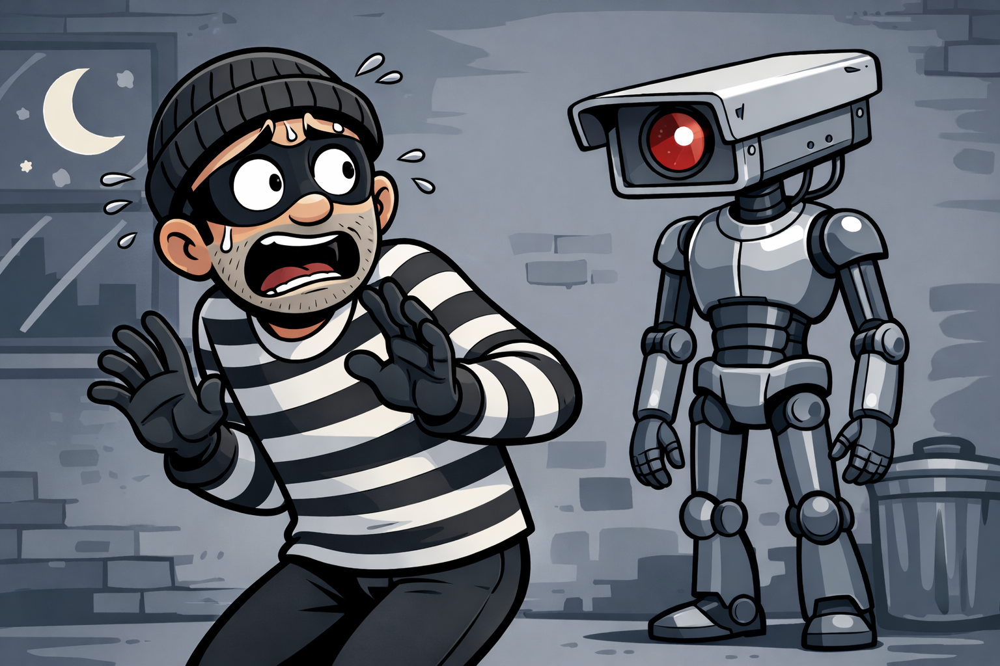

# ThiefBuster 2000 – Smart Motion Clip Generator  

  

- Automatically detects motion in video files and generates video clips of activity.  
- Users can define multiple Regions of Interest (ROIs), set per-region sensitivity and have the app search for motion.  
## Purpose
- Built partly for work-related tasks, but mostly **to learn and experiment**
- This project helped me learn or reinforce my knowledge of **UI, modular components, and video processing and architectural thinking**
- Learned or reinforced my knowledge of **UI, modular components, and video processing**

## Features  
- ROI-based motion detection: Top-left, top-right, bottom-left, bottom-right, and center each ROI's sensitivity can be adjusted by the user.  
- Adjustable cooldown in seconds: Prevents multiple clips for continuous movement.  
- Clips are saved automatically in the app directory.  
- Status messages indicate recording progress and completion.  

## How It Works  

- User Input: Select a video file.  
- User is displayed with screenshot of the video - first frame. This helps user to better assess the desired ROI.  
- Frame Processing:  
- Convert frames to grayscale   
- Apply blur to reduce noise    
- Compare against a background reference (previous frame)    
- Threshold and dilate differences to highlight motion  
- Motion Evaluation: Each ROI calculates motion separately.  
- Motion triggers recording, cooldown logic and expansion buffer manage clip length.  
- User Feedback: Status messages display current recording state; app closes when done.  

## Tech Stack  
- Python – Core language  
- OpenCV – Video and image processing  
- NumPy – Numerical computations  
- FFmpeg – Video clip generation  
- Tkinter – User interface  

## Installation
git clone https://github.com/RauncR/motionDetect.git
cd motionDetect
pip install -r requirements.txt
python main.py

## Usage  
- Launch the app.  
- Select video file.  
- Adjust ROIs and sensitivities, when done press ENTER.  
- "SEARCHING" is displayed.  
- When motion is detected and clip starts recording "RECORDING" blinks.
- App closes when done  

## Possible problems and their solutions:  
After grayscale and blur, pixel shade of gray change is compared against same pixel in previous frame. Shade of gray varies from black:0 to white:255. Point of decision can be set i.e 20 which allow minor pixel changes and helps to reduce pixel noise.  
It can also be lowered to "increase sensitivity" but it comes with a risk of fake positives. At the same time dilate iterations can also greatly increase sensitivity - again, greater risk of fake positives. User set sensitivity is only "percentage of changed pixels against whole pixels of ROI" to trigger motion.  
App logic tilts towards making code sensitive and give more responsibility for user to set desired sensitivity. Finding best balance between threshold, dilate and user-set sensitivity is the key for best possible app reliability.

Frame count is introduced to avoid 2 second clips. User sets it as cooldown in seconds which literally is (fps * seconds) - if that amount of frames will not trigger motion, clip is saved.  

## Future Improvements  

- Big picture on a high level: User launches the app (i.e ThiefBuster2000.exe) and is prompted to select either file search or live search. We have file search, but live screen monitoring should be written and introduced to completely avoid necessity for video exports from different interfaces. Depending on the library used, should the quality of the clip decrease compared to actual interface, saved clip would quickly guide to the actual time from the CCTV's server.  
User would draw a main frame box - usually complete camera view and then ROI (or perhaps several ROIs) and commands program on surveillance.  If motion detected - clip saved.  Features would be similar to current app.  
In layman's terms - leave the computer searching through the night if needed, save clips and check clips yourself the next day you return to work.  

- Opening a dedicated folder as app finishes.  
